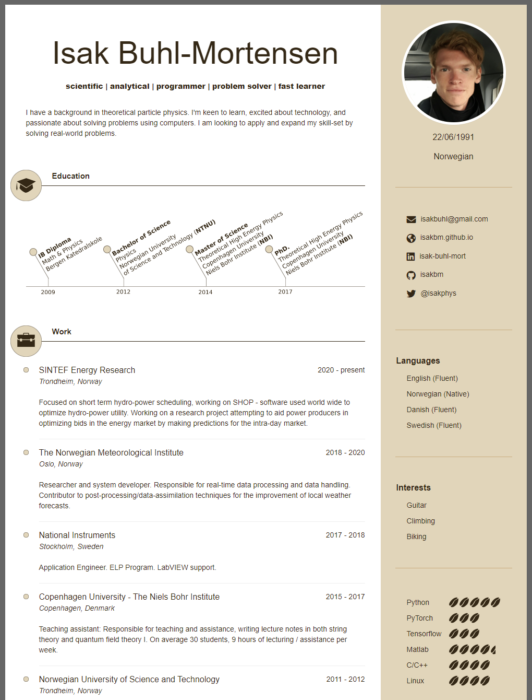

# Orbit
> This theme is designed by Xiaoying Riley at [3rd Wave Media](http://themes.3rdwavemedia.com/). 
> Visit her [website](http://themes.3rdwavemedia.com/) for more themes.

> It has been developed into a Jekyll Theme by [Biagio Brattoli](https://github.com/bbrattoli).

I am simply messing around with it, adding some of my own icons and changing the base css.

## Example

## Hosting Locally

1. Install jekyll
1. Navigate to the repo and fire off ``bundle init`` and ``bundle add jekyll``
1. Fire up the service ``bundle exec jekyll serve``
1. Your page is hosted at ``localhost:4000`` or some other port.

## License

This project is licensed under the [MIT license](LICENSE.txt).